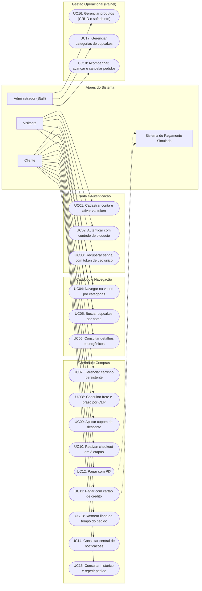

# Casos de uso do sistema

Este documento descreve o modelo de casos de uso do Cupcakes Gourmet para o PITE II (Engenharia de Software, Cruzeiro do Sul). O modelo contempla as 18 histórias de usuário implementadas no sistema, divididas entre visitantes, clientes autenticados, administradores e o sistema simulado de pagamentos.

## Diagrama geral de casos de uso

Utilizei a sintaxe de fluxo direcional do Mermaid (`flowchart LR`), amplamente suportada pelo GitHub, representando os atores como blocos retangulares e os casos de uso como nós arredondados no estilo estádio.

---

## Mapeamento das 18 histórias de usuário para os casos de uso

1. **US01 / UC01 - Cadastro de usuário com ativação**: criação de conta com validação de senha forte (mínimo 8 dígitos, maiúscula e número) e link de confirmação por token. Em modo demonstração, o link é exibido na tela para viabilizar testes.
2. **US02 / UC02 - Autenticação e segurança**: login por e-mail e senha. Bloqueio automático de 15 minutos ao atingir 3 falhas consecutivas e exigência de e-mail confirmado.
3. **US03 / UC03 - Recuperação de senha**: solicitação com mensagem neutra, token único com expiração em 60 minutos e invalidação imediata após o primeiro uso.
4. **US04 e US05 / UC04 - Navegação no catálogo**: listagem pública filtrada por categorias cadastradas no banco (Clássicos, Veganos, Temáticos) com ordenação por popularidade de vendas ou preço.
5. **US06 / UC05 - Busca por nome**: campo de pesquisa com debounce de 300 ms e normalização textual sem diferenciação de acentos ou maiúsculas via `unicodedata`.
6. **US07 / UC06 - Detalhes do produto**: página com ingredientes completos, estoque em tempo real e destaque visual obrigatório em amarelo para substâncias alergênicas.
7. **US08 e US09 / UC07 - Carrinho de compras persistido**: persistência no banco vinculada ao usuário logado, expiração lazy de 24 horas, trava de 10 unidades por item e verificação contra o estoque físico.
8. **US10 / UC08 - Frete regional por CEP**: consulta assíncrona à API pública do ViaCEP para preenchimento de endereço e tabela fixa por UF (PR, SC, RS, SP, RJ e MG). Frete grátis para compras com subtotal líquido superior a R$ 150,00.
9. **US14 / UC09 - Cupons de desconto**: validação de cupom ativo, vigência, valor mínimo de pedido e uso único por conta de usuário (`CupomUso`). O abatimento é aplicado exclusivamente sobre o subtotal dos cupcakes antes do frete.
10. **US11 / UC10 - Checkout em 3 etapas com reserva de estoque**: fluxo móvel estruturado em Endereço, Pagamento e Resumo. Criação de reserva temporária de estoque de 10 minutos ao ingressar no checkout para garantir que o cliente não perca os itens enquanto preenche os dados.
11. **US12 / UC11 - Pagamento simulado com cartão de crédito**: validação do número pelo algoritmo de Luhn, validade futura, CVV de 3 dígitos e cálculo de parcelamento de 1x a 12x (sem juros até 3x; juros compostos de 2,5% a.m. da 4x em diante).
12. **US13 / UC12 - Pagamento simulado com PIX**: geração de código fictício copia-e-cola e QR Code visual em SVG, extensão da reserva de estoque para 30 minutos e botão de confirmação simulada.
13. **US15 / UC13 - Rastreamento e linha do tempo**: acompanhamento do ciclo de vida do pedido com horários exatos de cada mudança de status e estimativa de entrega baseada na UF.
14. **US15 / UC14 - Central de notificações**: registro de avisos internos para cada alteração no pedido, com contador de mensagens não lidas no cabeçalho.
15. **US16 / UC15 - Histórico e repetir pedido**: listagem paginada de compras anteriores de 10 em 10, com botão para reinserir no carrinho os itens disponíveis em estoque.
16. **US17 / UC16 - Gestão de produtos no painel**: cadastro de novos cupcakes com validação de imagem via Pillow (até 5 MB), edição de dados e exclusão lógica (*soft delete*) para preservar o histórico de vendas.
17. **US17 (categorias) / UC17 - Gestão de categorias no painel**: controle de ativação, desativação e criação de categorias que organizam a vitrine da confeitaria.
18. **US18 / UC18 - Gestão e cancelamento de pedidos no painel**: filtragem de pedidos por status e data, avanço ordenado das etapas de preparo e cancelamento restrito aos estágios iniciais com reposição automática de estoque.

---

## Casos de uso expandidos

### Caso de uso expandido 01: UC01 - Realizar pedido de cupcakes

- **Identificador**: UC01
- **Nome**: Realizar pedido de cupcakes
- **Atores**: Cliente (primário), Sistema de Pagamento Simulado (secundário).
- **Objetivo**: Concluir a compra dos cupcakes selecionados no carrinho, garantindo a reserva temporária de estoque, a escolha da forma de entrega, a aplicação de cupom promocional e o processamento do pagamento via cartão ou PIX.
- **Pré-condições**:
  1. O cliente deve estar autenticado com e-mail confirmado.
  2. O carrinho de compras deve conter ao menos um item com quantidade superior a zero e estoque físico disponível.
- **Pós-condições**:
  1. O pedido é gerado no banco de dados com número legível único (`CG-AAMMDD-XXXXXXXXXX`).
  2. Para compras com cartão de crédito aprovado: status definido como `PAGAMENTO_CONFIRMADO`, estoque físico baixado definitivamente, contador de vendas do produto incrementado, carrinho esvaziado e notificação enviada.
  3. Para compras com PIX: status definido como `AGUARDANDO_PAGAMENTO`, reserva de estoque estendida para 30 minutos, código PIX gerado e carrinho esvaziado.

#### Fluxo principal (Pagamento via Cartão de Crédito Aprovado)

1. O cliente acessa a tela do carrinho (`/carrinho/`) e clica em **Finalizar Compra**.
2. O sistema executa a função de reserva (`estoque_service.reservar_itens`), bloqueando as quantidades no modelo `ReservaEstoque` por exatamente 10 minutos.
3. O sistema redireciona o cliente para a Etapa 1 do checkout: Seleção de Endereço (`/pedidos/checkout/`).
4. O cliente seleciona um endereço cadastrado anteriormente ou preenche os campos de um novo endereço informando o CEP.
5. O sistema valida o CEP via ViaCEP, verifica se o estado pertence à área de entrega coberta (PR, SC, RS, SP, RJ ou MG), calcula o valor do frete e o prazo em dias úteis através da `TabelaFreteUF`, grava a escolha na sessão e avança para a Etapa 2.
6. Na Etapa 2 (`/pedidos/checkout/pagamento/`), o sistema exibe as formas de pagamento disponíveis. O cliente seleciona **Cartão de Crédito** e clica em **Revisar Pedido**.
7. O sistema calcula a simulação de parcelamento de 1x até 12x sobre o valor total (aplicando juros compostos de 2,5% ao mês a partir da quarta parcela) e redireciona para a Etapa 3 (`/pedidos/checkout/resumo/`).
8. O cliente revisa os itens, os valores discriminados (subtotal, desconto de cupom e frete), seleciona o número de parcelas desejado e preenche os dados do cartão de crédito: número, nome impresso, validade (MM/AA) e código de segurança (CVV).
9. O cliente clica no botão **Confirmar Pedido**.
10. O sistema valida o cartão através do algoritmo de Luhn e confere se a validade é futura.
11. O sistema invoca `pedido_service.criar_pedido`:
    - Valida que a reserva de 10 minutos ainda está ativa e que há estoque suficiente.
    - Cria a instância do modelo `Pedido` e os respectivos registros de `ItemPedido` com os preços congelados no momento da compra.
    - Grava os detalhes do pagamento em JSON (apenas bandeira, parcelas e últimos 4 dígitos do cartão; nunca o número completo).
    - Se houver cupom ativo, registra a utilização no modelo `CupomUso`.
    - Altera o status para `PAGAMENTO_CONFIRMADO`, chamando `estoque_service.dar_baixa` para diminuir o saldo físico de estoque e aumentar `total_vendas`.
    - Desativa os registros em `ReservaEstoque`.
    - Insere o registro de status inicial em `HistoricoStatus`.
    - Gera a notificação interna para a central do cliente (`Notificacao`).
    - Remove os itens do carrinho de compras e limpa os dados temporários da sessão.
12. O sistema redireciona o cliente para a tela de confirmação e rastreamento (`/pedidos/pedido/<numero>/`), exibindo a linha do tempo com a confirmação imediata.

#### Fluxo alternativo A (Pagamento via PIX)

- **4a.** Na Etapa 2 (`/pedidos/checkout/pagamento/`), o cliente seleciona a opção **PIX** e clica em **Revisar Pedido**.
- **5a.** Na Etapa 3 (`/pedidos/checkout/resumo/`), o sistema apresenta o resumo com valor à vista (sem acréscimo de parcelamento) e um aviso destacando a validade de 30 minutos.
- **6a.** O cliente clica em **Confirmar Pedido**.
- **7a.** O sistema invoca `pedido_service.criar_pedido` com a forma `PIX`:
  - Gera o código fictício do PIX e define a expiração em `timezone.now() + timedelta(minutes=30)`.
  - Estende as reservas de estoque do cliente no modelo `ReservaEstoque` para os mesmos 30 minutos da validade do PIX.
  - Salva o pedido com o status `AGUARDANDO_PAGAMENTO`.
  - Registra a primeira entrada na linha do tempo (`HistoricoStatus`).
  - Esvazia o carrinho de compras.
- **8a.** O sistema redireciona o cliente para a tela de pagamento do PIX (`/pedidos/pedido/<numero>/`).
- **9a.** A tela renderiza o QR Code gerado em formato SVG puro, o código copia-e-cola em área de texto com botão de cópia e um contador regressivo de tempo restante.
- **10a.** Para efeitos de demonstração acadêmica, o cliente clica no botão **Confirmar Pagamento (Simulação)**.
- **11a.** O sistema recebe a requisição via POST (`/pedidos/pedido/<numero>/confirmar-pix/`), valida que o prazo de 30 minutos não expirou, atualiza o status para `PAGAMENTO_CONFIRMADO`, dá baixa definitiva no estoque físico via `estoque_service.dar_baixa` e atualiza a tela para a linha do tempo de entrega.

#### Fluxos de exceção

- **FE1 - Reserva temporária de 10 minutos expirada**: Se o cliente permanecer mais de 10 minutos nas etapas do checkout com cartão sem confirmar, a função `garantir_reservas` identifica que a reserva expirou. Se nesse intervalo outro cliente adquiriu as últimas unidades do produto, o sistema lança `ErroEstoque`, libera as reservas ativas, adiciona uma mensagem de alerta ("Um dos itens ficou indisponível. Revise seu carrinho.") e redireciona o cliente de volta para `/carrinho/`.
- **FE2 - Cartão de crédito recusado na simulação**: Se o cliente informar o cartão de testes com final `0002` (`4000 0000 0000 0002`), o serviço lança a exceção `PagamentoRecusado`. O sistema libera a reserva temporária de estoque, não gera o pedido e renderiza a tela `pedidos/recusado.html`, informando a não aprovação e oferecendo links diretos para tentar outro cartão ou optar por PIX.
- **FE3 - Dados do cartão inválidos (falha de validação)**: Se o número falhar no cálculo de Luhn, tiver validade vencida ou CVV divergente de 3 dígitos, o sistema recarrega a Etapa 2 (`pedidos/pagamento.html`) exibindo mensagens de erro específicas abaixo de cada campo incorreto, mantendo a reserva temporária ativa enquanto não passar o prazo de 10 minutos.
- **FE4 - Expiração de pagamento PIX sem confirmação**: Se o cliente gerar um pedido via PIX e não acionar a confirmação dentro dos 30 minutos, a rotina `verificar_expiracao` (executada sob demanda sempre que o pedido é consultado) altera o status para `CANCELADO`, desativa a reserva temporária de estoque associada e impede confirmações tardias. Caso o cliente tente clicar no botão após a expiração, recebe o aviso de que o PIX expirou e que as unidades voltaram ao catálogo.
- **FE5 - Endereço fora da abrangência de entrega**: Ao digitar um CEP pertencente a um estado que não consta na `TabelaFreteUF` (diferente de PR, SC, RS, SP, RJ e MG), o serviço `frete_service.calcular_frete` lança a exceção `ErroFrete`. O sistema bloqueia a transição para a Etapa 2 e exibe a mensagem: *"Infelizmente não entregamos neste endereço ainda."*
- **FE6 - Regra de frete grátis**: Durante o cálculo no carrinho ou no checkout, se o subtotal de cupcakes após o abatimento do cupom for estritamente superior a R$ 150,00 (ex: R$ 150,01), o frete é automaticamente zerado (`valor_frete = 0.00`) e a interface exibe a etiqueta verde "Frete Grátis". Com valor exatamente igual a R$ 150,00, o frete da tabela regional continua sendo cobrado.

---

### Caso de uso expandido 02: UC02 - Gerenciar produtos e pedidos no painel

- **Identificador**: UC02
- **Nome**: Gerenciar produtos e pedidos no painel administrativo
- **Atores**: Administrador / Colaborador da Confeitaria (usuário com `is_staff=True`).
- **Objetivo**: Permitir a manutenção do catálogo de doces (inclusão, alteração de estoque, soft delete de itens descontinuados) e a administração do fluxo operacional dos pedidos (avanço de etapas e cancelamento com reposição de insumos).
- **Pré-condições**: O usuário deve estar autenticado e possuir a flag `is_staff=True` ativa em seu cadastro.
- **Pós-condições**:
  1. Alterações em produtos refletem imediatamente na vitrine pública.
  2. Atualizações de status de pedidos geram registros datados em `HistoricoStatus` e notificações automáticas para o cliente.
  3. Cancelamentos autorizados recompõem o estoque físico no banco de dados.

#### Fluxo principal 1: Gestão de Produtos e Soft Delete

1. O administrador acessa a rota `/painel/` e clica na seção de **Produtos** (`/painel/produtos/`).
2. A listagem exibe todos os cupcakes cadastrados, inclusive itens desativados, mostrando estoque atual, preço, total de vendas e filtros de busca.
3. Para cadastrar um novo produto:
   - O administrador clica em **Novo Cupcake** (`/painel/produtos/novo/`).
   - Preenche nome, categoria associada, descrição, ingredientes, texto de alergênicos, preço de venda, estoque inicial e anexa a foto.
   - O formulário valida o arquivo com a biblioteca Pillow, certificando-se de que se trata de uma imagem real (PNG ou JPEG) e que o tamanho não ultrapassa 5 MB.
   - O sistema gera o slug automaticamente e salva o `nome_busca` sem acentos através de `unicodedata`.
   - O novo cupcake torna-se imediatamente visível para os clientes na vitrine.
4. Para retirar um cupcake de linha sem quebrar o histórico de pedidos passados:
   - O administrador localiza o produto e clica no botão **Desativar**.
   - O sistema invoca a exclusão lógica (*soft delete*), alterando o campo `ativo` para `False` (`produto.delete()`).
   - O produto é imediatamente ocultado das buscas e da vitrine pública, mas seu registro físico permanece íntegro no SQLite, preservando a chave estrangeira em todos os itens de pedidos antigos.
   - O administrador pode reativar o produto a qualquer momento pelo botão **Reativar** na mesma listagem.

#### Fluxo principal 2: Acompanhamento e Avanço de Pedidos

1. O administrador acessa a lista de pedidos no painel (`/painel/pedidos/`), podendo filtrar por status (`AGUARDANDO_PAGAMENTO`, `PAGAMENTO_CONFIRMADO`, `EM_PREPARACAO`, `SAIU_PARA_ENTREGA`, `ENTREGUE`, `CANCELADO`), cliente ou intervalo de datas.
2. O administrador clica em um pedido específico para abrir os detalhes (`/painel/pedidos/<numero>/`).
3. O sistema exibe os dados cadastrais do cliente, endereço de entrega completo, lista de cupcakes com quantidades, subtotal, cupom utilizado, frete, valor total e a linha do tempo atualizada.
4. À medida que a equipe da confeitaria produz e despacha a encomenda, o administrador clica no botão **Avançar Status**:
   - De `PAGAMENTO_CONFIRMADO` para `EM_PREPARACAO`.
   - De `EM_PREPARACAO` para `SAIU_PARA_ENTREGA`.
   - De `SAIU_PARA_ENTREGA` para `ENTREGUE`.
5. A cada avanço:
   - O método `pedido_service.alterar_status` valida se a transição é permitida de acordo com a máquina de estados.
   - Um novo registro é gravado em `HistoricoStatus` com a data e horário exatos.
   - Um registro em `Notificacao` é criado para o cliente correspondente, atualizando o contador do cabeçalho de sua conta.

#### Fluxo alternativo: Cancelamento de Pedido com Reposição de Estoque

1. Na visualização de detalhes do pedido, o administrador constata a necessidade de cancelamento (ex: solicitação do cliente antes do envio ou impossibilidade de produção).
2. O sistema verifica o status atual do pedido:
   - Se o status for `AGUARDANDO_PAGAMENTO` ou `EM_PREPARACAO`, o botão **Cancelar Pedido** fica habilitado para uso.
3. O administrador clica em **Cancelar Pedido** e confirma o motivo.
4. O sistema executa `pedido_service.alterar_status(pedido, "CANCELADO")`:
   - Se o pedido estiver em `EM_PREPARACAO`, significa que o pagamento já havia sido confirmado e o estoque físico havia sido baixado (`estoque_baixado == True`).
   - O sistema invoca atomicamente `estoque_service.repor_estoque`, somando as unidades de cada item de volta ao saldo do produto (`produto.estoque += item.quantidade`) e decrementando o `total_vendas`. A flag `estoque_baixado` é revertida para `False` para garantir que o estoque nunca seja reposto duas vezes.
   - Se o pedido estava em `AGUARDANDO_PAGAMENTO` com cupom de desconto aplicado, o sistema remove o registro em `CupomUso`, devolvendo ao cliente o direito de usar aquele cupom em uma compra futura.
   - Caso houvesse reservas temporárias ativas no modelo `ReservaEstoque` para aquele pedido PIX, elas são desativadas.
   - O status do pedido é alterado para `CANCELADO`.
   - É gravado o evento no histórico e gerada uma notificação com o título "Pedido cancelado" na conta do cliente.

#### Fluxos de exceção

- **FE1 - Tentativa de cancelamento em status não permitido**: Se o pedido já estiver no status `SAIU_PARA_ENTREGA` ou `ENTREGUE`, o botão de cancelamento é apresentado desabilitado na interface com a indicação de que o produto já está em rota externa ou foi recebido pelo cliente. Se houver tentativa de forçar a requisição POST via chamada direta, o serviço rejeita com `ErroPedido("Não é permitido mudar de Saiu para entrega para Cancelado")`.
- **FE2 - Acesso não autorizado por usuário comum**: Se um cliente comum ou visitante sem credenciais de colaborador tentar acessar qualquer rota iniciada por `/painel/`, o decorador `@staff_necessario` intercepta a requisição e redireciona o usuário para a página de login com parâmetro `next`, impedindo a visualização ou manipulação dos dados da loja.
