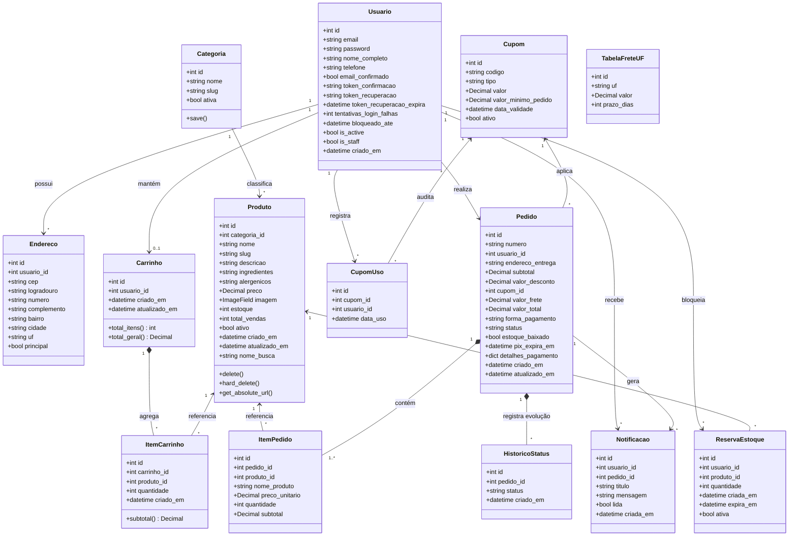
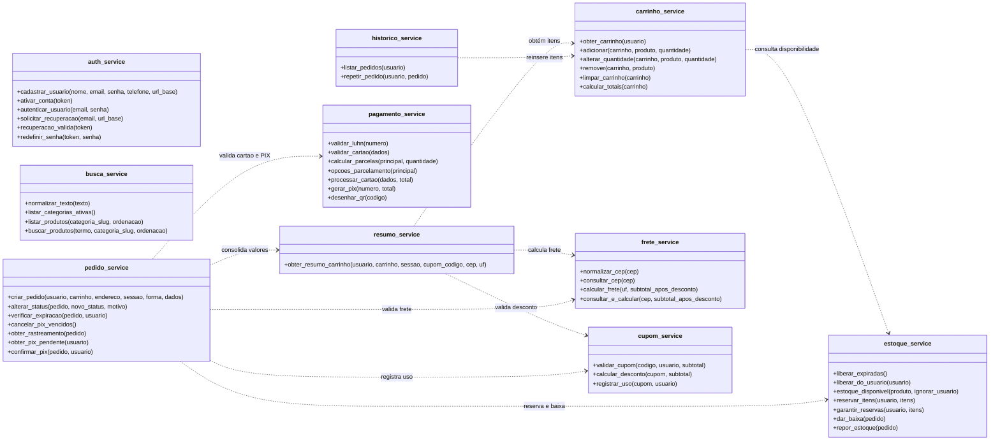

# Diagrama de classes

Este documento apresenta a modelagem estrutural orientada a objetos do sistema **Cupcakes Gourmet** para o PITE II (Engenharia de Software, Cruzeiro do Sul). O projeto segue o padrão arquitetural do Django (MTV), organizando os dados através de modelos ORM e desacoplando toda a lógica de negócios em uma camada dedicada de serviços (`services/`).

---

## 1. Diagrama de classes de domínio (Modelos)

O diagrama abaixo reflete com exatidão os 14 modelos de dados persistidos no banco SQLite (`usuarios`, `catalogo`, `carrinho` e `pedidos`), seus tipos reais, métodos de cálculo e as relações de multiplicidade.

---

## 2. Diagrama da camada de serviços (`services/`)

Para manter as views limpas e atuar em conformidade com as boas práticas de Engenharia de Software, as regras de negócio foram concentradas em serviços autônomos. O diagrama a seguir ilustra a distribuição das principais funções e suas interdependências:

---

## 3. O que mudou em relação ao PITE I

Durante a transição do projeto conceitual (PITE I) para a implementação executável completa no PITE II, realizei uma série de refatorações fundamentadas na necessidade prática de garantir consistência transacional, simplificação da arquitetura relacional e aderência estrita às regras de negócio.

### Classes novas incorporadas

1. **`Carrinho` e `ItemCarrinho`**:
   - *No PITE I*: o carrinho havia sido previsto apenas no lado do cliente (armazenamento local via JavaScript) ou em dicionários de sessão soltos no servidor.
   - *No PITE II*: implementei como modelos ORM persistidos no banco de dados vinculados diretamente ao usuário logado (`OneToOneField(Usuario)`). Essa decisão viabilizou a sincronização do carrinho entre diferentes abas e dispositivos, além de permitir o controle lazy de expiração (24 horas) e travas seguras contra a adição de itens sem estoque.
2. **`ReservaEstoque`**:
   - *Motivação*: sem essa classe, duas pessoas finalizando compras ao mesmo tempo poderiam gerar vendas duplicadas de um mesmo cupcake em baixa quantidade. A classe mantém reservas temporárias de 10 minutos (ou 30 minutos no PIX), permitindo que a função `estoque_disponivel` deduza unidades em processo de compra de outros clientes antes de confirmar novas reservas.
3. **`Cupom` e `CupomUso`**:
   - *Motivação*: introduzidas para atender ao requisito de cupons promocionais parametrizados (percentuais ou fixos, com data de expiração e compra mínima). O modelo `CupomUso` foi essencial para garantir a regra de uso único por conta de usuário de forma atômica e auditável.
4. **`TabelaFreteUF`**:
   - *Motivação*: criada para parametrizar de forma configurável os valores e prazos de entrega para os estados cobertos (PR, SC, RS, SP, RJ e MG), eliminando dependências de serviços externos pagos de frete e viabilizando a isenção de taxa para compras líquidas acima de R$ 150,00.
5. **`HistoricoStatus`**:
   - *Motivação*: adicionada para manter a trilha de auditoria e carimbos de data/hora de cada transição de status do pedido (`AGUARDANDO_PAGAMENTO` -> `PAGAMENTO_CONFIRMADO` -> `EM_PREPARACAO` -> `SAIU_PARA_ENTREGA` -> `ENTREGUE` ou `CANCELADO`), viabilizando a renderização da linha do tempo na tela de rastreamento do cliente.
6. **`Notificacao`**:
   - *Motivação*: criada para fornecer uma central de avisos internos integrada ao cabeçalho (ícone de sino com contador de mensagens não lidas), notificando o cliente instantaneamente a cada evolução no preparo e entrega de sua encomenda.

### Substituição de `Pagamento` e `Entrega` por campos e serviços do `Pedido`

No diagrama conceitual do PITE I, existiam duas tabelas independentes: `Pagamento` e `Entrega`, associadas ao `Pedido` por relações um-para-um (`1:1`).

Ao implementar o código real no PITE II, identifiquei que manter tabelas separadas gerava complexidade desnecessária de junções (*joins* relacionais) e risco de inconsistência em transações atômicas, sem trazer benefício real para um e-commerce artesanal de escopo enxuto:
- **Campos de Pagamento**: incorporei os dados diretamente no modelo `Pedido` através de `forma_pagamento` ('CARTAO' ou 'PIX'), `detalhes_pagamento` (campo `JSONField` estruturado contendo bandeira, parcelas, valor de parcelas e código PIX fictício) e `pix_expira_em`. Toda a lógica transacional, cálculo de juros compostos de 2,5% a.m. e algoritmo de Luhn ficaram isolados no módulo `pagamento_service.py`.
- **Campos de Entrega**: em vez de uma tabela `Entrega`, o `Pedido` armazena `endereco_entrega` como texto consolidado (congelando o logradouro, número, complemento, bairro, cidade, UF e CEP no instante exato da compra) e `valor_frete`. Dessa forma, se o cliente alterar ou excluir seu endereço no perfil posteriormente, o registro contábil e logístico daquele pedido permanece imutável e seguro. A lógica de consulta ao ViaCEP e apuração de prazos ficou encapsulada no `frete_service.py`.

Essa substituição simplificou a escrita e leitura no SQLite, reduziu a quantidade de migrações e concentrou o comportamento do domínio na camada de serviços.

### Atributos acrescentados às classes existentes

- **Na classe `Usuario`**:
  - `email_confirmado`: booleano que impede login antes do clique no link de validação.
  - `token_confirmacao`: hash SHA-256 do token temporário de ativação de conta.
  - `token_recuperacao` e `token_recuperacao_expira`: suporte à recuperação de senha segura com uso único e validade de 60 minutos.
  - `tentativas_login_falhas` e `bloqueado_ate`: campos de proteção contra ataques de força bruta, acionando o bloqueio estrito de 15 minutos ao atingir 3 falhas consecutivas.
- **Na classe `Produto`**:
  - `nome_busca`: campo indexado no banco que armazena o nome sem acentos e em minúsculas (gerado via `unicodedata`), garantindo busca insensível a acentuação compatível com o SQLite.
  - `alergenicos`: campo obrigatório de texto para comunicação clara de segurança alimentar na vitrine.
  - `ingredientes`: discriminação detalhada dos insumos utilizados na receita.
  - `total_vendas`: contador cumulativo atualizado na confirmação de pagamento para apoiar a ordenação nativa por popularidade.
  - `ativo`: booleano para implementar o *soft delete*, ocultando o cupcake do público sem quebrar chaves estrangeiras existentes.
- **Na classe `Pedido`**:
  - `estoque_baixado`: flag booleana de segurança que previne que o estoque seja baixado ou reposto mais de uma vez em operações concorrentes ou requisições repetidas de avanço/cancelamento.
