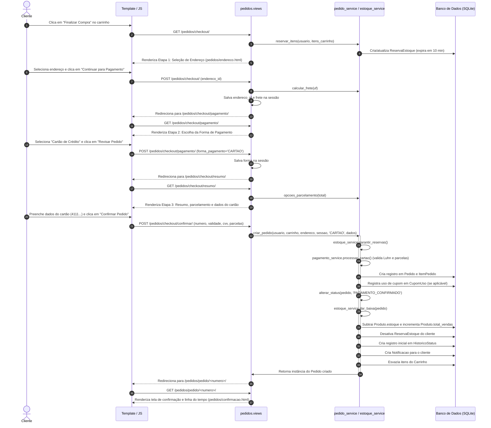
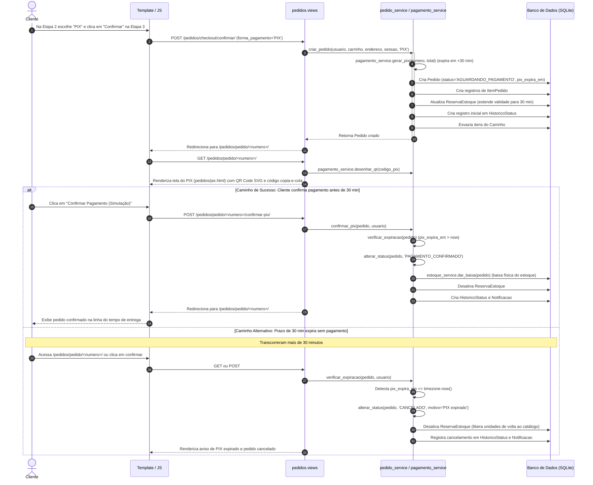
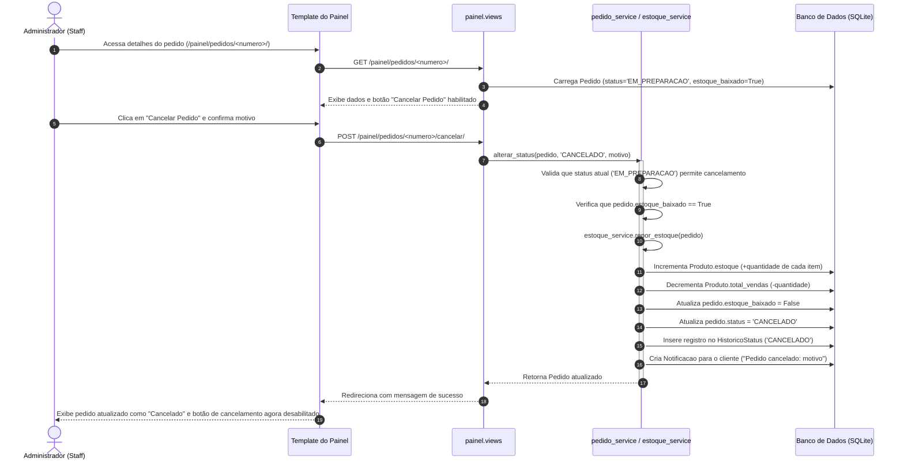
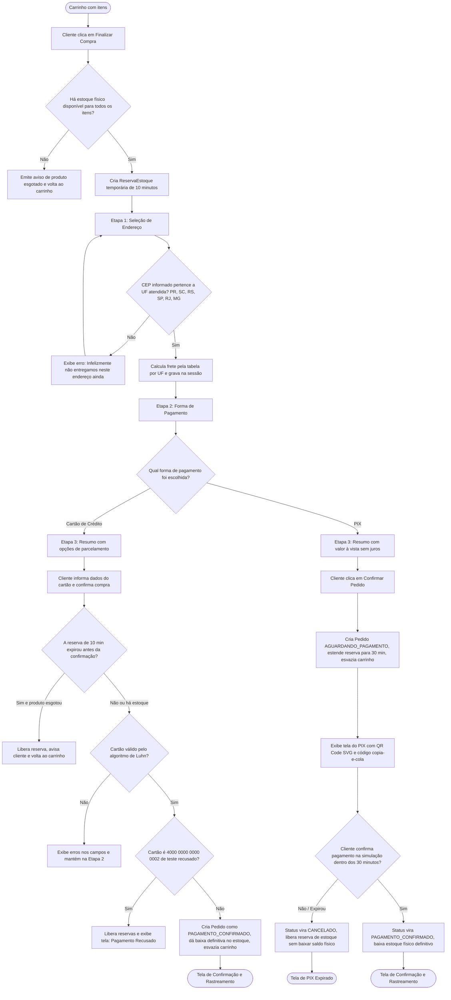

# Diagramas de sequência e fluxo de checkout

Este documento apresenta a modelagem dinâmica das principais operações do sistema **Cupcakes Gourmet** para o PITE II (Engenharia de Software, Cruzeiro do Sul). Foram elaborados três diagramas de sequência em Mermaid detalhando as interações entre os atores, templates/JavaScript, views, serviços de domínio e o banco de dados SQLite, além de um fluxograma com as decisões críticas do checkout.

---

## 1. Compra com cartão de crédito aprovado (do carrinho ao pedido pago)

Este diagrama representa o fluxo em que o cliente avança pelo checkout em 3 etapas, informa um cartão de crédito válido e obtém a confirmação imediata da compra com baixa física de estoque.

---

## 2. Compra com PIX (aguardando, reserva de 30 min, confirmação e expiração)

Este diagrama detalha o comportamento do pagamento via PIX, abrangendo a extensão da reserva para 30 minutos, o caminho de confirmação simulada e o caminho alternativo de cancelamento por expiração.

---

## 3. Cancelamento pelo administrador com reposição de estoque e notificação

Este diagrama mostra como o administrador da confeitaria atua no painel para cancelar um pedido em andamento, garantindo que o estoque seja reposto com segurança e que o cliente receba a notificação correspondente.

---

## 4. Fluxograma do checkout em 3 etapas e decisões de validação

O fluxograma abaixo detalha todas as etapas do processo de checkout, mapeando os desvios causados por reservas expiradas, indisponibilidade física de itens e recusa de pagamento simulado.

