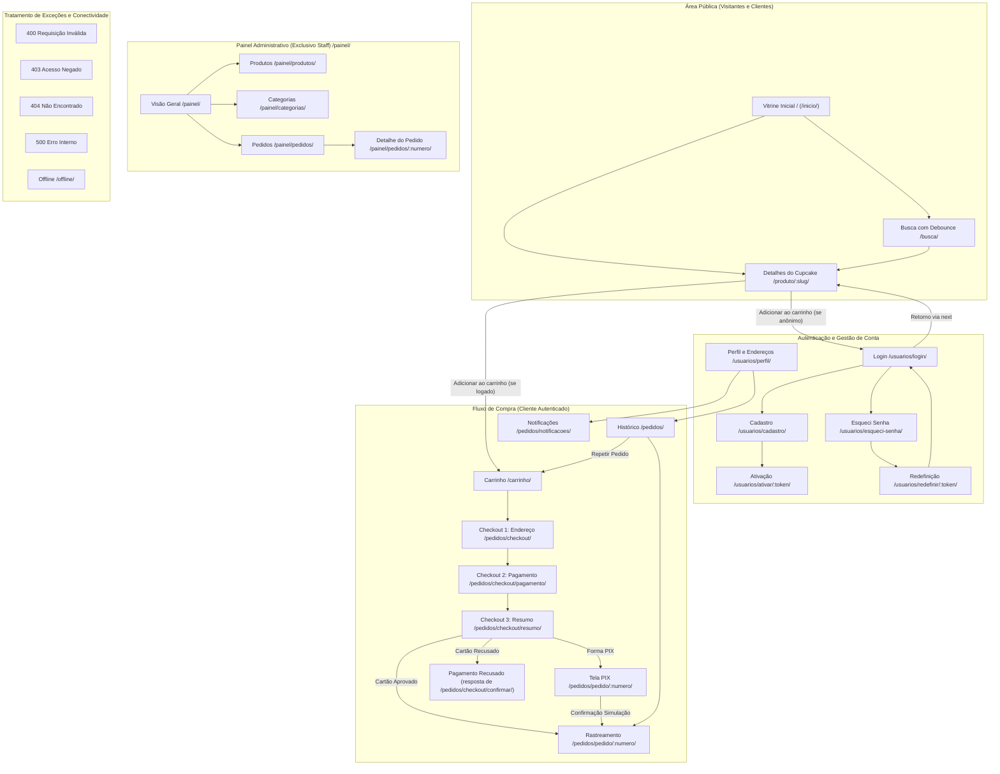

# Interação Humano-Computador (IHC) e interface

Este documento consolida o projeto de interface e a avaliação de Interação Humano-Computador (IHC) do **Cupcakes Gourmet** para o PITE II (Engenharia de Software, Cruzeiro do Sul). O sistema foi projetado sob a filosofia *mobile-first*, priorizando telas de toque de 360px a 430px de largura, comportando-se com elegância em navegadores desktop em uma coluna centralizada com largura máxima de 480px.

---

## 1. Mapa navegacional do sistema

O mapa navegacional abaixo ilustra a estrutura de telas e as rotas reais do projeto Django. Destaca com clareza que o visitante tem acesso irrestrito ao catálogo de produtos e só é direcionado para a tela de autenticação caso tente adicionar um item ao carrinho ou acessar rotas protegidas.



---

## 2. Inventário completo das telas do sistema

| Tela | Rota real no Django | Objetivo do usuário | Principais elementos de interface |
|---|---|---|---|
| **Vitrine Inicial** | `/` ou `/inicio/` | Visualizar os cupcakes disponíveis organizados por categorias e ordenados por popularidade. | Banner promocional de frete grátis, carrossel de chips de categorias ("Clássicos", "Veganos", "Temáticos"), seletor de ordenação, grid de cards com foto, preço, categoria e badge de carrinho no cabeçalho. |
| **Busca de Cupcakes** | `/busca/` | Localizar doces por nome instantaneamente sem distinção de acentos ou maiúsculas. | Campo de entrada com ícone de lupa e debounce de 300 ms, lista de resultados atualizada dinamicamente via Fetch/AJAX, mensagem amigável caso nenhum doce seja encontrado. |
| **Detalhes do Cupcake** | `/produto/<slug>/` | Consultar informações completas da receita antes da compra. | Foto ampliada, título, descrição sensorial, lista de ingredientes, banner amarelo de advertência para alergênicos, seletor de quantidade (+/-) e botão "Adicionar ao Carrinho" (desabilitado com texto "Indisponível" se estoque for zero). |
| **Carrinho de Compras** | `/carrinho/` | Revisar itens selecionados, alterar quantidades, simular frete e aplicar cupons promocionais. | Cards dos itens com foto e controles de incremento/decremento com resposta via Fetch, bloco de cálculo de frete por CEP com resposta rápida, campo para código promocional (`CUPCAKE10`), linhas de subtotal, desconto, frete e total geral, e botão "Finalizar Compra". |
| **Checkout Etapa 1: Endereço** | `/pedidos/checkout/` | Definir o local de entrega e validar o CEP de abrangência da confeitaria. | Barra de progresso com 3 passos (passo 1 ativo), lista de cartões de endereços cadastrados para seleção por clique único, formulário integrado para cadastro de novo endereço com preenchimento automático via ViaCEP e contador regressivo de 10 minutos da reserva temporária. |
| **Checkout Etapa 2: Pagamento** | `/pedidos/checkout/pagamento/` | Escolher a modalidade de pagamento da encomenda. | Barra de progresso (passo 2 ativo), opções clicáveis em destaque com rádio buttons para "Cartão de Crédito" e "PIX", banner azul fixo alertando o ambiente acadêmico com cobrança simulada e botão "Revisar Pedido". |
| **Checkout Etapa 3: Resumo** | `/pedidos/checkout/resumo/` | Conferir todos os valores e preencher os dados de confirmação da transação. | Barra de progresso (passo 3 ativo), resumo discriminado de produtos, frete e desconto, tabela de parcelamento de 1x a 12x (se cartão), campos de número de cartão, validade, CVV e nome impresso, e botão "Confirmar Pedido". |
| **Tela de Pagamento PIX** | `/pedidos/pedido/<numero>/` (status `AGUARDANDO_PAGAMENTO`) | Realizar o pagamento instantâneo por código ou QR Code. | QR Code gerado em SVG puro, código copia-e-cola de texto longo com botão "Copiar Código", contador visual de 30 minutos de validade, aviso de demonstração e botão de ação rápida "Confirmar Pagamento (Simulação)". |
| **Confirmação e Rastreamento** | `/pedidos/pedido/<numero>/` | Acompanhar a produção e a entrega da encomenda em tempo real. | Número legível do pedido (`CG-...`), linha do tempo vertical com marcadores circulares e horários exatos de cada mudança de status, previsão estimada de entrega baseada na UF e endereço completo. |
| **Pagamento Recusado** | `/pedidos/checkout/confirmar/` -> `recusado.html` | Entender a rejeição do cartão simulado e reorientar a compra. | Mensagem clara de que o pagamento não foi autorizado pela operadora (ao usar o cartão de testes `...0002`), aviso de liberação da reserva e botões diretos para tentar outro cartão ou optar por PIX. |
| **PIX Expirado** | `/pedidos/pedido/<numero>/` (após 30 min sem confirmação) | Informar que o prazo de pagamento encerrou e os itens retornaram ao estoque. | Card em tom de alerta informando cancelamento automático por decurso de prazo, explicação sobre a liberação dos produtos e botão para retornar ao catálogo. |
| **Histórico de Pedidos** | `/pedidos/` | Consultar compras passadas e repetir pedidos favoritos. | Lista de pedidos paginada de 10 em 10 com data, quantidade de itens, valor total, etiqueta colorida de status e botão de ação rápida "Repetir Pedido" (que valida o estoque atual e recria o carrinho). |
| **Central de Notificações** | `/pedidos/notificacoes/` | Visualizar mensagens informativas sobre o andamento dos pedidos. | Lista de avisos ordenados dos mais recentes para os mais antigos, distinção visual com borda rosa para notificações não lidas e botões para marcar como lida ou limpar todas. |
| **Perfil do Cliente** | `/usuarios/perfil/` | Gerenciar dados cadastrais e endereços de entrega. | Formulário de alteração de nome e telefone, lista de endereços cadastrados com botão de remoção e formulário para cadastro de novos endereços. |
| **Login** | `/usuarios/login/` | Autenticar o cliente na plataforma. | Campos de e-mail e senha, link para recuperação de senha, mensagens de validação genéricas ("E-mail ou senha inválidos"), aviso de bloqueio por 15 minutos em caso de 3 erros e link para cadastro. |
| **Cadastro** | `/usuarios/cadastro/` | Criar uma nova conta de cliente na confeitaria. | Campos de nome completo, e-mail, telefone, senha e confirmação de senha, medidor visual de força de senha em tempo real e banner azul em modo demonstração com link imediato de ativação. |
| **Ativação de Conta** | `/usuarios/ativar/<token>/` | Validar a conta através do token de segurança. | Botão de confirmação de ativação que consome o token de uso único e redireciona para a tela de login com mensagem de boas-vindas. |
| **Esqueci Minha Senha** | `/usuarios/esqueci-senha/` | Solicitar link de redefinição de acesso. | Campo de e-mail com resposta neutra de envio para proteger a privacidade de dados cadastrados e link de demonstração exibido em tela quando `MODO_DEMO=True`. |
| **Redefinição de Senha** | `/usuarios/redefinir/<token>/` | Criar nova senha utilizando o token de 60 minutos. | Campos para nova senha com indicador de força e validação estrita (mínimo 8 caracteres, maiúscula e número). |
| **Painel: Início** | `/painel/` | Visão panorâmica dos indicadores da confeitaria para a equipe. | Cards resumo de total de pedidos, produtos ativos, alerta numérico de cupcakes com estoque baixo (<= 5 unidades) e distribuição de pedidos por status com links diretos. |
| **Painel: Gestão de Produtos** | `/painel/produtos/` | Listar, buscar e controlar a disponibilidade de cupcakes. | Tabela responsiva com foto, nome, categoria, preço, estoque físico, total de vendas, status ativo/inativo, filtros por categoria/estoque e botões de editar e desativar (*soft delete*). |
| **Painel: Formulário de Produto** | `/painel/produtos/novo/` e `<pk>/editar/` | Cadastrar novo cupcake ou atualizar dados de estoque e imagem. | Campos para nome, slug automático, categoria, descrição, ingredientes, texto de alergênicos, preço, estoque, upload de imagem validado por Pillow (até 5 MB) e opção de exclusão/reativação. |
| **Painel: Gestão de Categorias** | `/painel/categorias/` | Manter a taxonomia de organização da vitrine. | Listagem com contagem de produtos associados, formulário para criação de nova categoria e alternador de ativação. |
| **Painel: Gestão de Pedidos** | `/painel/pedidos/` | Controlar a fila operacional de produção e entrega. | Filtros por status, data e cliente, listagem com número, cliente, valor total, status atual e link para visualização detalhada. |
| **Painel: Detalhe do Pedido** | `/painel/pedidos/<numero>/` | Operar o avanço de etapas de produção e cancelamento de pedidos. | Exibição de dados do cliente, endereço completo, itens encomendados, forma de pagamento, botão "Avançar Status" e botão "Cancelar Pedido" (habilitado apenas para pedidos em aberto ou em preparação, com reposição de estoque). |
| **Página 400 (Bad Request)** | `templates/400.html` | Informar que os parâmetros enviados pelo navegador estavam incorretos. | Identidade visual da confeitaria, mensagem explicativa e botão "Voltar para o início". |
| **Página 403 (Forbidden)** | `templates/403.html` | Informar falta de permissão de acesso a recursos restritos. | Aviso de acesso não autorizado e link para login ou retorno à vitrine. |
| **Página 404 (Not Found)** | `templates/404.html` | Orientar o usuário caso digite uma URL inexistente. | Mensagem acolhedora de página não encontrada e botão de retorno seguro para a vitrine. |
| **Página 500 (Server Error)** | `templates/500.html` | Exibir mensagem amigável em caso de instabilidade sem vazar dados técnicos. | Template estático puro (sem dependência de context processors ou banco de dados) garantindo renderização em qualquer falha de infraestrutura. |
| **Página Offline** | `/offline/` | Alertar o cliente sobre a perda transitória de conexão de internet. | Instrução para verificação da rede e botão com script JS nativo para recarregar a página. |

---

## 3. Princípios de IHC e as 10 Heurísticas de Jakob Nielsen aplicadas

A concepção das interfaces do Cupcakes Gourmet fundamentou-se nas Heurísticas de Usabilidade de Nielsen, traduzidas em soluções reais no código:

1. **Visibilidade do status do sistema**:
   - A tela de rastreamento (`confirmacao.html`) exibe uma linha do tempo vertical com marcações concluídas e carimbos de data/hora para cada estágio de preparo.
   - O cabeçalho possui badges com contadores dinâmicos de itens no carrinho e notificações não lidas.
   - O checkout apresenta o tempo restante de reserva temporária de estoque (10 minutos) e o PIX exibe um contador regressivo de 30 minutos.
2. **Correspondência entre o sistema e o mundo real**:
   - Uso de linguagem própria da gastronomia e confeitaria artesanal ("Massa fofinha", "Recheio cremoso", "Em preparação", "Saiu para entrega").
   - Estruturação de valores monetários no padrão brasileiro (`R$ XX,XX`), formato de CEP com máscara (`XXXXX-XXX`) e exibição de prazos em dias úteis.
3. **Controle e liberdade do usuário**:
   - O carrinho permite remover itens com um clique ou alterar quantidades livremente via botões de incremento e decremento.
   - A barra de navegação inferior fixa permite saltar entre vitrine, busca, pedidos e perfil sem perda do contexto de navegação.
   - Fornecimento de link acessível oculto ("Ir para o conteúdo") no topo da página para facilitar saltos de foco via teclado.
4. **Consistência e padronização**:
   - O botão de ação primária possui layout uniforme em todas as telas: cor rosa (`--rosa: #E91E8C`), cantos arredondados (`border-radius: 12px`), tipografia Poppins e altura mínima rigorosa de 44px.
   - Uso padronizado de cores semânticas para mensagens do sistema: verde para sucesso (`#e8f5e9`), vermelho para erros (`#ffebee`), amarelo para avisos/alergênicos (`#FFF3CD`) e azul para informações acadêmicas (`#E3F2FD`).
5. **Prevenção de erros**:
   - Quando um cupcake possui estoque zerado (`estoque == 0`), o botão de compra na vitrine e nos detalhes é desabilitado com o rótulo "Indisponível", impedindo a tentativa de compra de itens sem estoque.
   - Limite máximo fixado em 10 unidades por cupcake no carrinho, evitando acidentes de digitação ou compras em atacado que comprometeriam a produção artesanal.
   - Validação prévia de formato de CEP (8 dígitos numéricos) antes do envio da requisição e verificação de algoritmo de Luhn e validade futura no cartão.
6. **Reconhecimento em vez de memorização**:
   - Preenchimento automatizado dos campos de endereço (rua, bairro, cidade e UF) assim que o usuário digita o CEP, evitando que ele tenha que memorizar ou digitar dados cadastrais completos.
   - Na última etapa do checkout (Resumo), todos os dados do pedido (produtos, quantidades, valores, endereço completo de entrega e forma de pagamento) são agrupados em uma única visão antes do clique final.
7. **Flexibilidade e eficiência de uso**:
   - Implementação da funcionalidade **"Repetir Pedido"** no histórico, permitindo que clientes frequentes adicionem todos os itens de um pedido anterior de volta ao carrinho com um único toque.
   - Campo de busca com debounce de 300 ms, permitindo encontrar receitas conforme o usuário digita, sem necessidade de submeter formulários ou recarregar a página.
8. **Design estético e minimalista**:
   - Interface livre de poluição visual, banners invasivos ou textos promocionais excessivos, focando a atenção nas fotos reais dos doces e nas informações essenciais de compra.
   - Layout estritamente verticalizado e centralizado com largura de 480px, eliminando rolagem horizontal e dispersão de atenção.
9. **Ajuda aos usuários para reconhecer, diagnosticar e recuperar-se de erros**:
   - Mensagens de erro contextualizadas e claras: se o frete for de estado não coberto, o sistema avisa *"Infelizmente não entregamos neste endereço ainda"*; se o cupom exigir valor mínimo, avisa *"Este cupom é válido para compras acima de R$ 30,00"*.
   - No painel administrativo, quando um pedido atinge o estágio `SAIU_PARA_ENTREGA` ou `ENTREGUE`, o botão de cancelamento fica desabilitado com um aviso claro explicando que pedidos já despachados não podem ser cancelados no painel.
10. **Ajuda e documentação**:
    - Destaque preventivo de alergênicos em banner amarelo no detalhe do doce, garantindo informação médica/nutricional acessível antes da ingestão.
    - Avisos em caixas azuis de ambiente de demonstração acadêmica esclarecendo que pagamentos são fictícios e exibindo links de teste para facilitar a avaliação do projeto.

---

## 4. Identidade visual e diretrizes de acessibilidade

### Paleta de cores real do sistema (`estilos.css`)

```css
:root {
  --rosa: #E91E8C;        /* Rosa vibrante - Ações primárias e destaque da marca */
  --dourado: #F5A623;     /* Dourado artesanal - Detalhes nobres e força de senha média */
  --fundo: #F5F5F5;       /* Cinza bem claro - Fundo suave para descanso visual */
  --superficie: #FFFFFF;   /* Branco puro - Cards, formulários e áreas de leitura */
  --texto: #212121;       /* Grafite escuro - Leitura com alto contraste */
}
```

- **Banner de Alergênicos**: Fundo `#FFF3CD`, Borda `#FFEEBA`, Texto `#856404`.
- **Banner de Modo Demonstração e Alertas Neutros**: Fundo `#E3F2FD`, Borda `#BBDEFB`, Texto `#0D47A1`.
- **Mensagens de Sucesso**: Fundo `#e8f5e9`, Borda `#a5d6a7`, Texto `#205727`.
- **Mensagens de Erro e Alertas Críticos**: Fundo `#ffebee`, Borda `#ef9a9a`, Texto `#a21d35`.

### Tipografia

- **Títulos, cabeçalhos, botões e valores principais**: `Poppins`, sans-serif (pesos 500, 600 e 700), proporcionando personalidade contemporânea e excelente legibilidade em títulos compactos.
- **Corpo de texto, parágrafos, rótulos e mensagens**: `Nunito`, sans-serif (pesos 400, 600 e 700), com formas orgânicas e acolhedoras adequadas ao universo da confeitaria artesanal.

### Acessibilidade (WCAG 2.1 nível AA)

- **Alvos de toque mínimos de 44px**: Todos os botões (`button`, `.botao`), campos de formulário (`input`, `select`), itens de menu inferior (`.navegacao a`) e chips de categoria possuem altura mínima forçada via CSS (`min-height: 44px`), atendendo rigorosamente à diretriz de acessibilidade para dispositivos móveis e touchscreens.
- **Contraste de cores**: A combinação de texto `#212121` sobre fundos brancos `#FFFFFF` e cinzas `#F5F5F5` atinge uma taxa de contraste superior a 14:1, ultrapassando a exigência mínima de 4.5:1 da WCAG AA. Nos botões rosa com texto `#212121`, o peso tipográfico 800 e a área de superfície garantem legibilidade imediata.
- **Rótulos e leitores de tela**: Todos os campos possuem tags `<label>` semânticas associadas por ID ou atributos `aria-label` explícitos (como nos botões de sino de notificações, carrinho e ícones SVG inline). Indicadores de estado utilizam `aria-current="step"` no checkout e `aria-current="page"` na navegação.
- **Indicador de foco visível**: A regra `:focus-visible { outline: 3px solid #0D47A1; outline-offset: 3px; }` garante navegação por teclado limpa e evidente para usuários de tecnologias assistivas.

---

## 5. O que revisei nos wireframes do PITE I e como ficou

Na etapa de concepção inicial do PITE I, foram elaborados os primeiros wireframes conceituais. Ao transportar os desenhos para a implementação com templates reais em HTML5/CSS3 no PITE II, realizei três intervenções essenciais de design e usabilidade:

1. **Correção de rótulos sobrepostos e campos colidindo no mobile**:
   - *No PITE I*: os wireframes previam formulários com rótulos horizontais alinhados ao lado dos campos em uma mesma linha. Ao testar em telas de smartphones com 360px de largura, os rótulos quebravam em várias linhas ou sobrepunham o início do campo de texto.
   - *Como ficou no PITE II*: adotei layout verticalizado estrito (`display: block` e espaçamentos em `margin`), posicionando o rótulo logo acima do campo de entrada com margem inferior de 5px, garantindo que mesmo nomes extensos ou mensagens de erro nunca colidam com o componente interativo.
2. **Remoção de avaliações e comentários públicos do MVP**:
   - *No PITE I*: existia uma seção de comentários e estrelas de avaliação dos clientes na página de cada produto.
   - *Como ficou no PITE II*: optei por retirar essa funcionalidade para manter o foco na integridade do fluxo de checkout, cálculo confiável de frete e controle de estoque com reservas temporárias. Em um e-commerce artesanal em fase de validação, avaliações sem moderação poderiam gerar ruído de interface; no lugar disso, aprimorei o destaque dos ingredientes e o alerta sanitário de alergênicos, agregando mais valor prático para o cliente.
3. **Navegação livre para visitantes sem bloqueio por login prematuro**:
   - *No PITE I*: a proposta previa que qualquer pessoa precisava criar conta ou logar antes mesmo de visualizar o catálogo completo de cupcakes.
   - *Como ficou no PITE II*: corrigi essa fricção permitindo navegação 100% aberta e irrestrita na vitrine, categorias, busca textual e página de detalhes. O usuário só é convidado a fazer login no exato momento em que decide adicionar um doce à sua sacola de compras, sendo redirecionado de volta para o produto após o login através do parâmetro `next`, reduzindo drasticamente o abandono de novos clientes.
