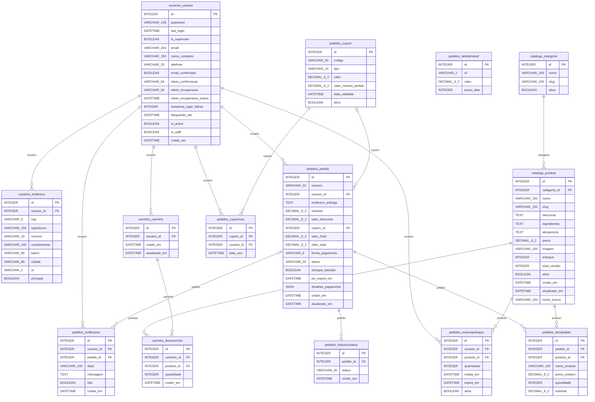

# Diagrama entidade-relacionamento

Gerado a partir das chaves estrangeiras reais do banco. GitHub desenha o diagrama automaticamente.

```mermaid
erDiagram
    usuarios_usuario {
        INTEGER id PK
        VARCHAR_128 password
        DATETIME last_login
        BOOLEAN is_superuser
        VARCHAR_254 email
        VARCHAR_150 nome_completo
        VARCHAR_20 telefone
        BOOLEAN email_confirmado
        VARCHAR_64 token_confirmacao
        VARCHAR_64 token_recuperacao
        DATETIME token_recuperacao_expira
        INTEGER tentativas_login_falhas
        DATETIME bloqueado_ate
        BOOLEAN is_active
        BOOLEAN is_staff
        DATETIME criado_em
    }
    usuarios_endereco {
        INTEGER id PK
        INTEGER usuario_id FK
        VARCHAR_9 cep
        VARCHAR_150 logradouro
        VARCHAR_20 numero
        VARCHAR_100 complemento
        VARCHAR_80 bairro
        VARCHAR_80 cidade
        VARCHAR_2 uf
        BOOLEAN principal
    }
    catalogo_categoria {
        INTEGER id PK
        VARCHAR_100 nome
        VARCHAR_100 slug
        BOOLEAN ativa
    }
    catalogo_produto {
        INTEGER id PK
        INTEGER categoria_id FK
        VARCHAR_150 nome
        VARCHAR_150 slug
        TEXT descricao
        TEXT ingredientes
        TEXT alergenicos
        DECIMAL_8_2 preco
        VARCHAR_100 imagem
        INTEGER estoque
        INTEGER total_vendas
        BOOLEAN ativo
        DATETIME criado_em
        DATETIME atualizado_em
        VARCHAR_150 nome_busca
    }
    carrinho_carrinho {
        INTEGER id PK
        INTEGER usuario_id FK
        DATETIME criado_em
        DATETIME atualizado_em
    }
    carrinho_itemcarrinho {
        INTEGER id PK
        INTEGER carrinho_id FK
        INTEGER produto_id FK
        INTEGER quantidade
        DATETIME criado_em
    }
    pedidos_tabelafreteuf {
        INTEGER id PK
        VARCHAR_2 uf
        DECIMAL_6_2 valor
        INTEGER prazo_dias
    }
    pedidos_cupom {
        INTEGER id PK
        VARCHAR_30 codigo
        VARCHAR_10 tipo
        DECIMAL_6_2 valor
        DECIMAL_8_2 valor_minimo_pedido
        DATETIME data_validade
        BOOLEAN ativo
    }
    pedidos_cupomuso {
        INTEGER id PK
        INTEGER cupom_id FK
        INTEGER usuario_id FK
        DATETIME data_uso
    }
    pedidos_reservaestoque {
        INTEGER id PK
        INTEGER usuario_id FK
        INTEGER produto_id FK
        INTEGER quantidade
        DATETIME criada_em
        DATETIME expira_em
        BOOLEAN ativa
    }
    pedidos_pedido {
        INTEGER id PK
        VARCHAR_20 numero
        INTEGER usuario_id FK
        TEXT endereco_entrega
        DECIMAL_8_2 subtotal
        DECIMAL_8_2 valor_desconto
        INTEGER cupom_id FK
        DECIMAL_6_2 valor_frete
        DECIMAL_8_2 valor_total
        VARCHAR_6 forma_pagamento
        VARCHAR_20 status
        BOOLEAN estoque_baixado
        DATETIME pix_expira_em
        JSON detalhes_pagamento
        DATETIME criado_em
        DATETIME atualizado_em
    }
    pedidos_itempedido {
        INTEGER id PK
        INTEGER pedido_id FK
        INTEGER produto_id FK
        VARCHAR_150 nome_produto
        DECIMAL_8_2 preco_unitario
        INTEGER quantidade
        DECIMAL_8_2 subtotal
    }
    pedidos_historicostatus {
        INTEGER id PK
        INTEGER pedido_id FK
        VARCHAR_20 status
        DATETIME criado_em
    }
    pedidos_notificacao {
        INTEGER id PK
        INTEGER usuario_id FK
        INTEGER pedido_id FK
        VARCHAR_100 titulo
        TEXT mensagem
        BOOLEAN lida
        DATETIME criada_em
    }
    carrinho_carrinho ||--o{ carrinho_itemcarrinho : "carrinho"
    catalogo_categoria ||--o{ catalogo_produto : "categoria"
    catalogo_produto ||--o{ carrinho_itemcarrinho : "produto"
    catalogo_produto ||--o{ pedidos_itempedido : "produto"
    catalogo_produto ||--o{ pedidos_reservaestoque : "produto"
    pedidos_cupom |o--o{ pedidos_pedido : "cupom"
    pedidos_cupom ||--o{ pedidos_cupomuso : "cupom"
    pedidos_pedido |o--o{ pedidos_notificacao : "pedido"
    pedidos_pedido ||--o{ pedidos_historicostatus : "pedido"
    pedidos_pedido ||--o{ pedidos_itempedido : "pedido"
    usuarios_usuario ||--o{ carrinho_carrinho : "usuario"
    usuarios_usuario ||--o{ pedidos_cupomuso : "usuario"
    usuarios_usuario ||--o{ pedidos_notificacao : "usuario"
    usuarios_usuario ||--o{ pedidos_pedido : "usuario"
    usuarios_usuario ||--o{ pedidos_reservaestoque : "usuario"
    usuarios_usuario ||--o{ usuarios_endereco : "usuario"
```
