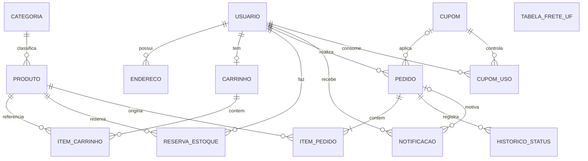

# Modelo conceitual, lógico normalizado e classes de persistência

Este documento fecha o projeto de dados pedido na Situação 1. O dicionário de dados e o SQL físico vêm do banco real e estão na mesma pasta. Aqui explico como cheguei neles.

## 1. Modelo conceitual

No modelo conceitual só aparecem as entidades e como elas se relacionam, sem tipos nem chaves. A tabela de frete não se liga a nenhuma outra por chave: ela é consultada pela UF do endereço.

Cada entidade em uma frase:

- **Usuário**: cliente ou administrador. **Endereço**: onde o cliente recebe.
- **Categoria** e **Produto**: o cardápio. O produto tem estoque e pode ser desativado sem ser apagado.
- **Carrinho** e **Item do carrinho**: o que o cliente separou; um carrinho por usuário.
- **Reserva de estoque**: segura unidades por alguns minutos durante o checkout.
- **Pedido** e **Item do pedido**: a compra fechada, com os valores e os preços daquele momento.
- **Histórico de status**: cada mudança de etapa do pedido, com data e hora.
- **Notificação**: aviso interno ao cliente.
- **Cupom** e **Uso do cupom**: regras de desconto e o controle de uso único por conta.
- **Tabela de frete por UF**: valor e prazo por estado atendido.

## 2. Classes de persistência

No sistema, as classes de persistência são os modelos do Django. Cada classe vira uma tabela.

| Classe (modelo) | App | Tabela |
|---|---|---|
| Usuario | usuarios | usuarios_usuario |
| Endereco | usuarios | usuarios_endereco |
| Categoria | catalogo | catalogo_categoria |
| Produto | catalogo | catalogo_produto |
| Carrinho | carrinho | carrinho_carrinho |
| ItemCarrinho | carrinho | carrinho_itemcarrinho |
| ReservaEstoque | pedidos | pedidos_reservaestoque |
| Cupom | pedidos | pedidos_cupom |
| CupomUso | pedidos | pedidos_cupomuso |
| TabelaFreteUF | pedidos | pedidos_tabelafreteuf |
| Pedido | pedidos | pedidos_pedido |
| ItemPedido | pedidos | pedidos_itempedido |
| HistoricoStatus | pedidos | pedidos_historicostatus |
| Notificacao | pedidos | pedidos_notificacao |

No PITE I eu tinha as classes Pagamento e Entrega. Não as mantive como tabelas porque o pagamento é simulado e a entrega é acompanhada só por status: a forma de pagamento e os detalhes (parcelas e últimos quatro dígitos do cartão, código PIX fictício) ficam no próprio pedido, e o endereço de entrega é uma cópia do endereço no momento da compra.

## 3. Como normalizei

Parti de uma ficha de pedido como ela seria numa planilha, tudo junto:

`PEDIDO(numero, data, cliente_nome, cliente_email, cliente_endereco, { produto_nome, categoria_nome, preco, quantidade }, cupom_codigo, cupom_percentual, cupom_validade, frete, total)`

**1ª forma normal.** Cada campo passa a guardar um valor só, e o grupo que se repete deixa de ficar dentro do pedido. O endereço é dividido em rua, número, bairro, cidade, UF e CEP. Os produtos do pedido vão para uma tabela própria de itens, uma linha por produto.

**2ª forma normal.** Na tabela de itens a chave é o par pedido e produto. O nome, a categoria e o preço do produto dependem só do produto, e não do par inteiro. Então eles saem e ficam na tabela de produtos, e o item guarda só a quantidade. Do mesmo modo, os dados do cliente dependem só do cliente e vão para a tabela de usuários.

**3ª forma normal.** Sobram dependências que passam por outro atributo. O nome da categoria depende da categoria, que depende do produto: a categoria ganha tabela própria. O percentual, a validade e o valor mínimo do cupom dependem do código do cupom, não do pedido: o cupom ganha tabela própria e o pedido guarda só a referência. O endereço do cliente também é uma tabela à parte, porque um cliente pode ter vários.

O resultado é o modelo lógico abaixo. Todas as tabelas estão na 3ª forma normal.

## 4. Modelo lógico normalizado

| Tabela | Chave primária | Chaves estrangeiras e restrições |
|---|---|---|
| usuarios_usuario | id | email único |
| usuarios_endereco | id | usuario_id |
| catalogo_categoria | id | nome único, slug único |
| catalogo_produto | id | categoria_id, slug único |
| carrinho_carrinho | id | usuario_id único (um carrinho por usuário) |
| carrinho_itemcarrinho | id | carrinho_id, produto_id |
| pedidos_reservaestoque | id | usuario_id, produto_id |
| pedidos_cupom | id | codigo único |
| pedidos_cupomuso | id | cupom_id, usuario_id |
| pedidos_tabelafreteuf | id | uf única |
| pedidos_pedido | id | usuario_id, cupom_id (opcional), numero único |
| pedidos_itempedido | id | pedido_id, produto_id |
| pedidos_historicostatus | id | pedido_id |
| pedidos_notificacao | id | usuario_id, pedido_id (opcional) |

Todos os campos, tipos e domínios estão no [dicionário de dados](dicionario-de-dados.md) e o script completo, no [modelo físico](modelo-fisico.sql).

## 5. Onde escolhi não normalizar por completo

Alguns campos repetem informação de propósito. Anotei o motivo de cada um:

- **Nome e preço unitário no item do pedido.** Se o preço do cupcake mudar ou o produto for desativado, os pedidos antigos precisam continuar mostrando o que o cliente comprou e pagou.
- **Endereço de entrega no pedido.** É uma cópia em texto do endereço usado na compra. Se o cliente editar ou apagar o cadastro depois, o pedido não muda.
- **Subtotal, desconto, frete e total no pedido.** Poderiam ser recalculados, mas guardo os valores cobrados para o histórico e para conferência.
- **Total de vendas no produto.** É um valor somado, mantido para ordenar o catálogo por popularidade sem varrer todos os pedidos.
- **Nome de busca no produto.** É o nome sem acento e em minúsculas, para a busca funcionar no SQLite.
- **Detalhes do pagamento (JSON).** Guarda dados que variam conforme a forma de pagamento. Nunca guarda o número completo do cartão.
