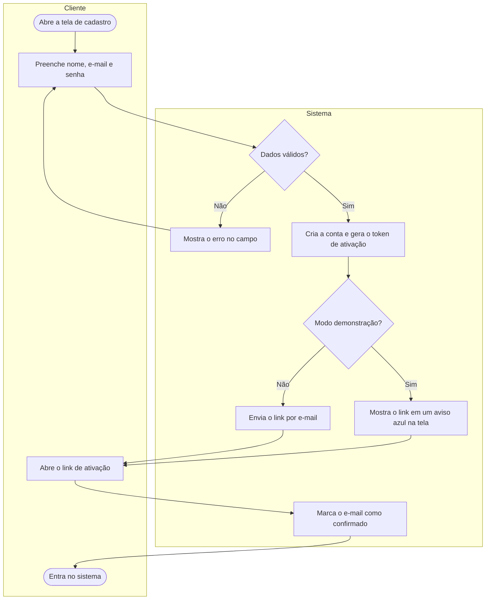
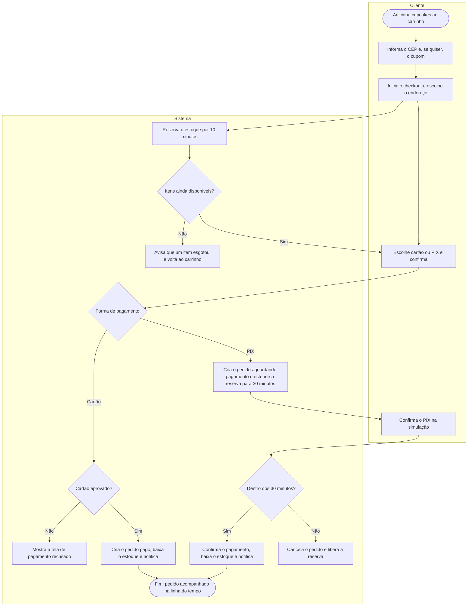
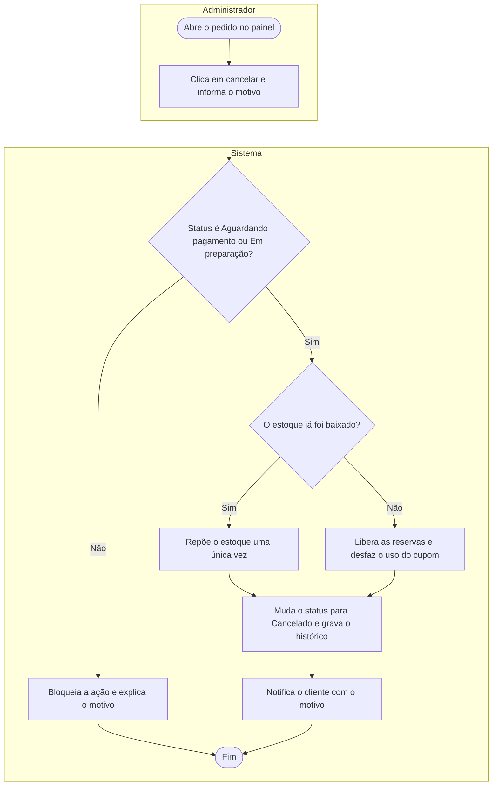

# Diagramas de atividades

Fiz três diagramas de atividades para os fluxos em que mais existem decisões: cadastro com ativação, compra e cancelamento pelo administrador. Cada raia mostra quem executa a ação. As regras são as mesmas que estão nos serviços do sistema.

## 1. Cadastro e ativação da conta

## 2. Compra com cartão ou PIX

## 3. Cancelamento de pedido pelo administrador

